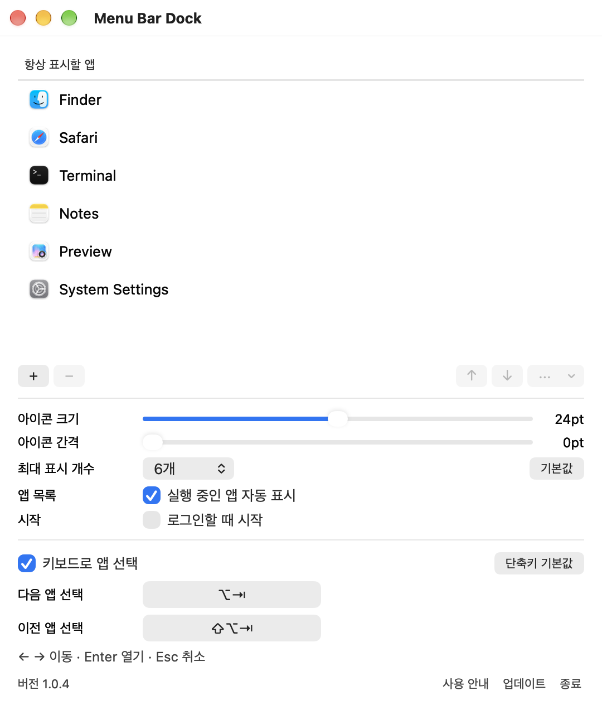
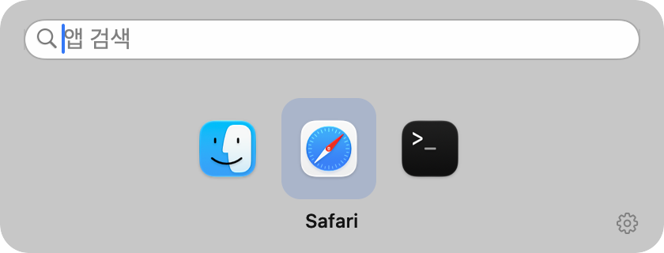

# Menu Bar Dock

macOS Dock에 고정한 앱과 실행 중인 앱을 메뉴 막대에서 바로 여세요.

<p align="center">
  
</p>

각 앱 아이콘을 클릭하면 바로 실행하거나 전환합니다. 앱 순서·크기·간격을 조절하고, 메뉴 막대에 다 들어가지 않는 앱은 `Option+Tab`으로 선택할 수 있습니다.

[시작하기](#시작하기) · [사용 안내](docs/user-guide.md) · [개발과 기여](CONTRIBUTING.md) · [아키텍처](docs/architecture.md) · [배포](docs/releasing.md)

## 시작하기

macOS 14 이상의 Apple Silicon Mac이 필요합니다. 배포 파일은 [GitHub Releases](https://github.com/jeonghyeon-net/menubar-dock/releases)에서 제공합니다. 같은 버전의 DMG·ZIP과 `SHA256SUMS`를 같은 폴더에 내려받아 확인한 뒤, DMG를 열고 앱을 `Applications`로 옮깁니다.

```sh
shasum -a 256 -c SHA256SUMS
```

서명·공증 상태와 대상 커밋은 각 릴리스 본문에 표시합니다. 첫 실행에서는 설정 창이 열립니다. 기존 Menu Bar Dock을 사용 중이라면 먼저 종료해 주세요.

<details>
<summary>소스에서 빌드하기</summary>

Swift 6.2 이상의 Xcode 또는 Command Line Tools, Python 3.9 이상이 필요합니다. [mise](https://mise.jdx.dev/)가 설치되어 있다면 다음 명령을 실행합니다.

```sh
git clone https://github.com/jeonghyeon-net/menubar-dock.git
cd menubar-dock
mise trust
mise run app
open "build/Menu Bar Dock.app"
```

Swift와 macOS SDK는 `xcode-select`로 선택한 Apple 도구 체인을 사용하며 외부 Swift 패키지는 내려받지 않습니다. `mise` 없이 `make app`을 실행해도 같은 스크립트를 사용합니다. Python은 개발·배포 도구에만 필요하며 앱에는 포함하지 않습니다.

서명 인증서를 지정하지 않은 로컬 빌드는 ad-hoc 서명입니다. 실제 확인한 환경과 남은 검증 항목은 [검증 기록](docs/implementation-plan.md)에 있습니다.

</details>

버전은 `mise run version`으로 확인합니다. 패키지 생성·검사·한국어 릴리스 노트·게시 명령은 [빌드와 릴리스](docs/releasing.md)에 정리되어 있습니다.

## 앱 열기와 설정

아래 설정과 검색 기능은 개발 중인 1.0.4 기준입니다. 현재 공개된 v1.0.3에는 포함되지 않은 변경이 있습니다.

- 메뉴 막대에는 **앱 아이콘만** 표시합니다. 각 아이콘을 왼쪽 클릭하면 앱을 실행하거나 기존 앱으로 전환합니다.
- 아이콘을 우클릭하고 **설정…** 항목을 선택하면 앱 목록과 모든 옵션이 한 창에 열립니다. Control-클릭, 앱 재실행, `Option+Tab` 패널의 톱니 버튼으로도 접근할 수 있습니다.
- 설정의 **항상 표시할 앱** 목록에 `+`로 앱을 추가합니다. 목록에 있는 앱은 종료 후에도 남으며, `↑`·`↓` 버튼이나 드래그로 순서를 저장합니다.
- 목록에 없는 실행 중인 앱은 앞쪽에, 등록한 앱은 뒤쪽에 지정한 순서로 표시합니다. 같은 앱은 한 번만 표시합니다.
- 아이콘 우클릭 메뉴의 **목록에 추가**로 실행 중인 앱을 등록할 수 있습니다. **목록에서 제거** 또는 설정의 `−`로 지운 앱은 자동으로 다시 나타나지 않으며, `+`로 복원합니다.

| 표시 설정 | 기본값 | 조절 범위 |
| --- | --- | --- |
| 아이콘 크기 | 24pt | 16–32pt |
| 아이콘 간격 | 0pt | 0–28pt |

간격 0pt는 앱이 추가하는 여백이 없는 상태입니다. macOS가 각 메뉴 막대 항목에 붙이는 기본 여백은 남습니다. **기본값** 버튼은 크기와 간격만 되돌립니다. 메뉴 막대에 다 들어가지 않는 앱도 `Option+Tab` 선택 패널에서 열 수 있습니다.

<details>
<summary>설정 화면 보기</summary>

<p align="center">
  
</p>

</details>

macOS Dock에 고정한 앱과 Finder는 자동으로 가져옵니다. 이후 처음 발견한 Dock 앱만 **항상 표시할 앱** 목록 끝에 추가하며, 이미 정한 순서와 이전 버전에서 제외·삭제한 앱은 유지합니다. 목록에 없는 실행 중인 앱은 설정 목록에 추가하지 않고 실행하는 동안만 표시합니다. **실행 중인 앱 자동 표시**를 끄면 등록한 앱만 표시합니다. 기본 메뉴 막대 표시 한도는 6개이고 설정에서 늘릴 수 있습니다.

앱 실행과 활성화는 저장된 순서를 바꾸지 않습니다. 실행 중 점·밑줄·배지는 표시하지 않으며, 새 앱의 창 위치는 macOS와 해당 앱이 결정합니다. 메뉴 막대가 가려졌을 때도 Finder에서 Menu Bar Dock을 다시 열면 설정에 접근할 수 있습니다.

## 키보드로 선택하기

<p align="center">
  
</p>

| 키 | 동작 |
| --- | --- |
| `Option+Tab` | 선택 패널 열기 또는 다음 앱 선택 |
| `Shift+Option+Tab` | 이전 앱 선택 |
| 방향키 | 앱 선택 이동. 검색 중에는 위·아래로 결과 선택 |
| `Enter` | 선택한 앱 또는 검색 결과 열기 |
| `Esc` | 검색어 지우기, 비어 있으면 닫기 |

선택 패널에는 메뉴 막대의 최대 표시 개수와 관계없이 표시 대상 앱 전체가 나타납니다. Option 키를 놓아도 앱이 열리지 않습니다. Enter로 선택을 확정합니다. 패널의 톱니 버튼으로 설정을 열고 아래쪽에서 다음·이전 단축키를 바꿀 수 있습니다.

패널에서 바로 입력하면 **Spotlight 인덱스의 앱·파일·폴더를 이름으로 검색**합니다. 입력을 지우면 기존 앱 선택으로 돌아옵니다. 별도 색인이나 외부 검색 서비스 없이 동작하며, 검색한 앱을 **항상 표시할 앱** 목록에 추가하지 않습니다. 자세한 범위는 [Spotlight 검색](docs/user-guide.md#spotlight-검색)에 있습니다.

## 로컬 개발 명령

| 명령 | 결과 |
| --- | --- |
| `mise run toolchain` | 선택된 Swift 버전과 Apple 개발 도구 경로 확인 |
| `mise run check` | 경고를 오류로 처리하는 빌드와 자동 테스트 |
| `mise run input-check` | 실제 버튼 클릭·메뉴와 아이콘 크기별 렌더링 검사 |
| `mise run settings-input-check` | 실제 슬라이더를 트랙 밖까지 드래그하며 떨림 검사 |
| `mise run switcher-input-check` | 검색창 실제 입력·한글 조합·결과 선택·취소 검사 |
| `mise run app` | `build/Menu Bar Dock.app` 생성 |
| `mise run run` | 앱을 빌드한 뒤 실행 |
| `mise run smoke` | 앱을 빌드한 뒤 실제 시작·설정 저장·정상 종료 검사 |
| `mise run package` | `dist/packages/<버전>/`에 ZIP·DMG·체크섬·manifest 생성 |
| `mise run version` | Git 태그 기반 현재·다음 패치 버전 확인 |
| `mise run package-test` | ZIP·DMG 내부 앱과 서명·버전·체크섬 검사 |
| `mise run release-plan` | 게시할 버전·커밋·원격 상태 확인 |
| `mise run release-prepare` | 릴리스 검사·패키징·한국어 노트 생성 |
| `mise run release` | 검증한 `main`의 태그·배포 파일을 GitHub Release에 게시 |

명령 정의는 [mise.toml](mise.toml), 빌드·테스트·패키징 구현은 [scripts/](scripts/)에 있습니다. 자동 테스트와 실기기 확인 범위는 구분해 검증 기록에 남깁니다.

## 코드와 문서

Swift 6와 AppKit으로 구현하며 Apple Silicon용 `arm64` 앱 번들을 생성합니다.

```text
DockDomain       등록 앱 순서·실행 앱 표시·삭제 정책과 앱·검색 선택 세션
DockPersistence  JSON 저장, 원자 교체, 손상 복구
DockPlatform     앱 감지·실행·아이콘·로그인 항목·Spotlight 검색
DockShortcuts    전역 단축키 등록·저장·충돌 복구
MenuBarDock      앱 수명, 유스케이스 조립, AppKit 화면
```

도메인은 Foundation만 참조합니다. 앱 목록과 설정은 이 Mac에 저장하고, 업데이트 확인은 사용자가 요청할 때 실행합니다.

| 문서 | 내용 |
| --- | --- |
| [사용 안내](docs/user-guide.md) | 설치, 설정, 단축키, 문제 해결 |
| [개발과 기여](CONTRIBUTING.md) | 로컬 작업 흐름, 책임 경계, 검증 기준 |
| [아키텍처](docs/architecture.md) · [모듈 계약](docs/module-contracts.md) | 상태와 데이터 흐름, 모듈별 책임 |
| [설계 결정](docs/adr/) | 기술 선택의 이유와 변경 기록 |
| [구현·검증 기록](docs/implementation-plan.md) | 진행 단계, 실행한 검사, 남은 확인 범위 |
| [빌드와 배포](docs/releasing.md) | 앱 번들, 패키지, 서명·공증, 게시 절차 |
| [보안](SECURITY.md) · [변경 기록](CHANGELOG.md) | 보안 제보와 버전별 변경 |

개발은 `main`에서 진행하며 검증한 변경을 직접 커밋·푸시합니다. PR과 GitHub Actions workflow는 사용하지 않습니다.

[EthanSK/Menu-Bar-Dock](https://github.com/EthanSK/Menu-Bar-Dock)의 사용 경험을 참고해 별도 코드로 구현했습니다. [MIT 라이선스](LICENSE)로 배포합니다.
