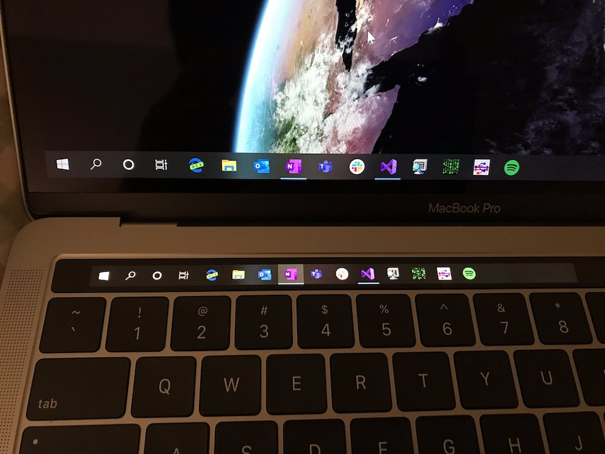

# Menu Bar Dock

Dock은 숨기고, 앱은 메뉴 막대에서 여세요.

  

각 앱 아이콘을 클릭하면 바로 실행하거나 전환합니다. 앱 순서·크기·간격을 조절하고, 메뉴 막대에 다 들어가지 않는 앱은 `Option+Tab`으로 선택할 수 있습니다.

[다운로드·설치](#시작하기) · [사용 안내](docs/user-guide.md) · [개발과 기여](CONTRIBUTING.md)

## 시작하기

macOS 14 이상의 Apple Silicon Mac에서 사용할 수 있습니다.

1. [최신 릴리스](https://github.com/jeonghyeon-net/menubar-dock/releases/latest)의 **Assets**에서 `.dmg` 파일을 다운로드합니다.
2. DMG를 열고 **Menu Bar Dock**을 **Applications(응용 프로그램)** 폴더로 드래그합니다.
3. 응용 프로그램 폴더에서 **Menu Bar Dock**을 실행합니다.

처음 실행하면 설정 창이 열립니다.

## 사용하기

아래 화면과 사용법은 개발 중인 **1.0.4** 기준입니다. 공개된 **v1.0.3**은 [해당 버전의 사용 안내](https://github.com/jeonghyeon-net/menubar-dock/blob/v1.0.3/docs/user-guide.md)를 참고하세요.

- 메뉴 막대의 앱 아이콘을 **왼쪽 클릭**하면 앱이 열립니다.
- `Option+Tab` 패널의 **톱니 버튼**으로 설정을 엽니다. 아이콘 우클릭 메뉴나 Menu Bar Dock 재실행으로도 열 수 있습니다.
- 설정의 **항상 표시할 앱**에 `+`로 추가하고 드래그로 순서를 정합니다. `−`로 제거한 앱은 `+`로 다시 추가할 때까지 나타나지 않습니다.
- 등록하지 않은 실행 중 앱은 앞쪽에, 등록한 앱은 뒤쪽에 저장한 순서로 표시합니다. 같은 앱은 한 번만 표시합니다.

macOS Dock에 고정한 앱과 Finder는 자동으로 가져옵니다. 아이콘 크기·간격·최대 표시 개수와 로그인할 때 시작 여부는 설정에서 바꿀 수 있습니다.

`Option+Tab`으로 앱을 고른 뒤 **Enter**로 엽니다. 패널에서 이름을 입력하면 이 Mac의 앱을 검색합니다. **Esc**는 검색어를 지우고, 검색어가 없으면 패널을 닫습니다.

설정과 키보드 선택 화면

  

  

자세한 조작과 문제 해결은 [사용 안내](docs/user-guide.md)에 있습니다.

## 만든 이유

가뜩이나 작은 맥북 화면에서 Dock이 차지하는 공간이 아까워 만들었습니다. 앱 실행과 전환을 이미 있는 메뉴 막대로 옮기면 화면 아래쪽을 작업 공간으로 쓸 수 있습니다. macOS의 Dock 자동 숨김과 함께 사용하세요.

  

참고 이미지: Windows 작업 표시줄을 Touch Bar에 표시한 실험. [Jablíčkář.cz 기사](https://jablickar.cz/ko/touch-bar-na-windows/)에 실린 사진입니다.

## 개발과 문서

Swift와 AppKit으로 만든 Apple Silicon용 앱입니다. 소스 빌드와 기여 방법은 [개발 안내](CONTRIBUTING.md)를 따릅니다.

- [아키텍처](docs/architecture.md) · [모듈 계약](docs/module-contracts.md) · [설계 결정](docs/adr/)
- [빌드와 배포](docs/releasing.md) · [검증 기록](docs/implementation-plan.md)
- [변경 기록](CHANGELOG.md) · [보안 문제 제보](SECURITY.md)

[EthanSK/Menu-Bar-Dock](https://github.com/EthanSK/Menu-Bar-Dock)의 사용 경험을 참고해 별도 코드로 구현했습니다. [MIT 라이선스](LICENSE)로 배포합니다.
