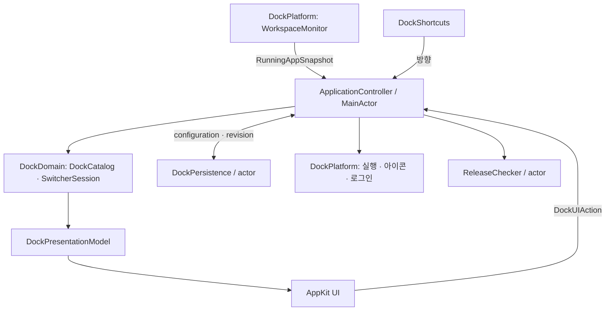

# 기술 스택과 아키텍처

2026-09-28 · 현재 구현 기준. 검증 결과와 남은 실기기 검증은 [구현 기록](implementation-plan.md)에 구분한다.

## 제품 계약

사용자가 정한 순서를 유지하는 메뉴 막대 런처다. 고정 앱과 실행 중인 일반 앱의 합집합을 표시하며, 자동 추가는 설정으로 끌 수 있다. 앱 활성화는 순서를 바꾸지 않는다. 실행 중 점·밑줄·배지와 예약 공간은 없다.

단축키는 Option+Tab / Shift+Option+Tab 이동, Enter 실행, Esc 취소다. Option을 놓아도 실행하지 않는다. 사용자가 조합을 변경할 수 있다. 이미 실행된 앱에는 표준 reopen/activate 요청을 보내고, 종료된 앱은 실행한다. 새 창의 디스플레이 강제 지정과 다른 앱 창 이동은 사용자 요청으로 제외했다.

## 기술 선택

| 영역 | 구현 |
| --- | --- |
| 언어·플랫폼 | Swift 6 모드, Swift 6.2+, macOS 14+, arm64 |
| 앱 수명 | NSApplicationDelegate, LSUIElement |
| 메뉴 막대 | 단일 NSStatusItem, 표준 NSStatusBarButton.image |
| 설정·선택 | AppKit NSTabView / NSTableView / NSPanel |
| OS 연동 | NSWorkspace, NSRunningApplication, SMAppService |
| 단축키 | Carbon RegisterEventHotKey, 조합만 등록 |
| 저장 | Codable JSON, actor, 원자 교체, 정상 백업 |
| 진단 | OSLog Logger, OSSignposter |
| 테스트 | Swift Testing, 주입 가능한 OS 경계, AppKit responder 테스트 |
| 빌드·배포 | Swift Package, 앱 번들·DMG 스크립트, GitHub Actions |
| 업데이트 | 사용자가 요청할 때 GitHub Releases 확인 |

외부 패키지 의존성은 없다. [빌드 결정](adr/0001-native-package-app.md), [AppKit·단축키 결정](adr/0002-appkit-and-system-hotkeys.md), [업데이트 결정](adr/0003-explicit-update-check.md)에 근거와 트레이드오프를 남겼다. Developer ID 인증서가 있으면 Hardened Runtime 서명과 공증을 수행할 수 있다. 인증서 없는 빌드는 ad-hoc 서명이다.

## 경계와 데이터 흐름

| 구성요소 | 책임 | 경계 |
| --- | --- | --- |
| DockCatalog aggregate | 설치 항목, 순서, 고정·제외 정책, 표시 투영, 이력 정리 | Foundation만 참조 |
| SwitcherSession | 시작 시 순서 고정, 순환 선택, 제거된 항목 조정 | UI·프로세스에 독립 |
| ApplicationController | 이벤트 수신, 유스케이스, 저장 revision, 서비스 수명 | 유일한 영속 도메인 변경 지점 |
| ConfigurationRepository | schema 검사, 원자 저장·백업·손상 원본 보존 | actor가 파일 작업 직렬화 |
| WorkspaceMonitor | 앱 알림·KVO를 스냅샷으로 정규화 | UI 순서 정책 없음 |
| ApplicationLauncher | 정확한 설치 위치 실행, 실행 요청 병합, 프로세스 재검증 | backend 주입으로 OS 없는 테스트 |
| GlobalShortcutService | 등록 수명, 사용자 조합, 충돌 복구, 누름 반복 | 일반 키 입력 감시 없음 |
| UI controllers | 화면 표현, 입력을 명령으로 변환 | 저장·OS 실행 직접 접근 없음 |

단일 프로세스이며 helper, daemon, 데이터베이스를 두지 않는다. composition root가 서비스를 소유한다. 세부 값 타입마다 protocol을 만들지 않고 실제 외부 경계에 테스트 대역을 둔다. 동작 API는 [모듈 계약](module-contracts.md)을 따른다.

## 식별자와 순서

`AppID`는 설치 항목의 영속 UUID다. PID·앱 이름·bundle identifier를 영속 ID로 쓰지 않는다. `AppEntry`에 bundle 경로·identifier·bookmark를 저장한다. 같은 identifier라도 다른 설치 경로이면 서로 다른 항목이다. bookmark로 이동한 앱을 복원하며, 경로를 잃으면 설정에서 다시 지정한다. 검증 가능한 앱 번들 URL이 없는 프로세스는 목록에 넣지 않는다.

`DockConfiguration`은 항목 목록과 독립적인 `order: [AppID]`를 갖는다. 새 항목은 끝에 추가하며 기존 항목의 상대 순서를 보존한다. 중복 이벤트로 고정·제외 상태를 덮지 않는다. 비고정·비실행·비제외 이력은 90일/256개 상한으로 정리하고 고정·제외·실행 항목은 보호한다. 삭제와 제외는 구별한다. 실행 중 앱을 목록에서 삭제하면 자동 재발견을 막기 위해 제외로 남긴다.

실행 상태는 `RunningAppSnapshot`으로 분리한다. PID에 bundle URL과 launchDate를 함께 비교하여 PID가 재사용된 뒤 다른 프로세스를 숨기거나 종료하지 않는다. 모든 AppKit 작업은 MainActor에서 수행한다. 파일 저장은 actor에 보내고 늦은 revision을 거절한다.

## 시작·이벤트·종료

설정 로드 → bookmark 복구 → UI controller 준비 → 관찰 시작·초기 스냅샷 → 최종 표시 목록 → status item 게시 순서다. 초기 빈 슬롯을 여러 개 생성하지 않는다. 시작 중 Finder 재실행 요청은 설정이 준비될 때 처리한다.

WorkspaceMonitor는 runningApplications KVO와 실행·종료·활성화·숨김·wake 알림을 사용한다. 활성화 알림 payload를 보존하고 accessor를 다시 읽어 덮지 않는다. 초기·wake 등에서 스냅샷을 조정하며 주기 polling은 없다. [실행 앱 KVO](https://developer.apple.com/documentation/appkit/nsworkspace/runningapplications), [종료 알림의 범위](https://developer.apple.com/documentation/appkit/nsworkspace/didterminateapplicationnotification).

설정은 변경 후 180ms 동안 합쳐 저장한다. 종료 시 변경 수신을 멈추고 최신 revision을 저장한 뒤 관찰자·단축키·패널을 해제한다. 저장 실패는 종료를 취소하거나 사용자가 명시적으로 저장 없이 종료할 수 있도록 안내한다. 일반 저장 실패도 설정에 표시한다.

## 메뉴 막대와 디스플레이

하나의 NSStatusItem을 수명 동안 유지한다. autosaveName으로 macOS가 전체 항목 위치를 기억하고, 앱은 내부 순서만 관리한다. Command+drag는 전체 strip을 이동한다. 개별 순서는 설정에서 drag 또는 위·아래 버튼으로 바꾼다.

앱 아이콘을 1x/2x 이미지로 합성해 **표준 NSStatusBarButton.image**에 전달한다. 앱마다 status item을 만들거나 길이 0인 항목을 숨기지 않는다. 공유 NSImage의 크기를 변경하지 않는다. 앱이 없는 경우와 compact 모드는 glyph 하나이며, 초과 앱은 overflow 메뉴에 표시한다.

기본값은 아이콘 18pt, 간격 4pt, 끝 여백 합계 6pt, 최대 6개다. 실제 버튼 높이에 맞춰 icon 크기를 제한한다. 외관·배율·화면·접근성 표시 설정 변경 시 다시 그린다. 강제 aqua/darkAqua, 고정 대비 필터, 강제 active material을 사용하지 않는다. 시스템의 정상적인 비활성 dimming은 유지한다. [NSStatusItem](https://developer.apple.com/documentation/appkit/nsstatusitem).

사용자 [회귀 참고 이미지](assets/inactive-display-reference.png)의 흰색 번짐과 청록색 편향은 실제 두 화면에서 비교해야 한다. 표준 렌더링 경로 채택만으로 그 현상이 해결됐다고 확정하지 않는다. 노치로 전체 항목이 가려질 수 있으므로 compact·표시 개수·Finder 재실행 설정 접근을 제공한다. `isVisible`은 가림 판정 수단이 아니다. [Apple 문서](https://developer.apple.com/documentation/appkit/nsstatusitem/isvisible).

아이콘 rect를 AppID에 연결하고 mouse down의 ID와 mouse up의 ID가 일치할 때만 실행한다. 각 아이콘은 이름과 press/show-menu action을 갖는 접근성 버튼으로 노출한다.

## 키보드와 실행

선택 패널은 생성 시 nonactivatingPanel 스타일을 고정한 NSPanel이다. 마우스가 있는 화면의 visibleFrame에 표시하며, 화면 구성 변경 시 닫는다. 타 앱 창 위치를 조사하지 않는다. [NSPanel 스타일](https://developer.apple.com/documentation/appkit/nswindow/stylemask-swift.struct/nonactivatingpanel).

세션이 열릴 때 목록 순서를 고정한다. 선택 도중 새 앱은 추가하지 않고 사라진 항목만 제거한다. 현재 앱이 없으면 정방향 첫 항목·역방향 마지막 항목부터 시작한다. 방향키·Tab도 이동하며 Return/keypad Enter는 선택, Escape는 취소한다. 전역 단축키와 패널 입력이 중복 이동하지 않도록 등록 조합은 전역 경로에서 처리한다.

Carbon에는 지정 조합 두 개만 등록한다. 설정 기록 동안 등록을 중지하고 재개하며, 충돌 때 이전 조합을 복구한다. 키를 누르는 동안에만 반복 타이머가 있고 release/suspend/stop 시 제거한다. 단축키 실패해도 마우스와 설정에 접근할 수 있다.

ApplicationLauncher는 같은 설치 경로의 진행 중 요청을 합친다. NSWorkspace.openApplication에 `createsNewApplicationInstance=false`, `allowsRunningApplicationSubstitution=false`를 명시한다. 실행 중 앱에는 표준 reopen 후 unhide/activate를 요청한다. 다른 설치 위치가 반환되거나 활성화가 거절되면 오류를 전달한다. 사용자 의도 없는 재시도나 강제 focus 탈취는 없다. [OpenConfiguration](https://developer.apple.com/documentation/appkit/nsworkspace/openconfiguration).

앱 종료 Bool은 요청 수락 여부이며 실제 종료는 이벤트로 확인한다. 저장 대화상자로 종료가 취소되면 계속 실행 중인 앱이다. [terminate 계약](https://developer.apple.com/documentation/appkit/nsrunningapplication/terminate()).

## 저장·보안·배포

`~/Library/Application Support/net.jeonghyeon.MenuBarDock/preferences.json`에 schema, 앱, order, 표시 설정을 저장한다. 단축키 조합만 UserDefaults에 단독 저장한다. 로그인 상태는 SMAppService에서 읽는다.

- 파일은 원자 교체, 정상 백업, 오래된 revision 거부로 보호한다.
- 손상 JSON은 별도 파일로 보존하고 백업 또는 기본값으로 복구한다.
- 미래 schema는 읽기 전용으로 열고 원본과 백업을 덮지 않는다.
- 디렉터리 0700, 설정 파일 0600 권한을 사용한다.
- 프로세스 목록·아이콘·선택 상태는 영속화하지 않는다.
- 자동 네트워크 통신·원격 분석이 없다. 업데이트 확인은 사용자 명령으로만 실행한다.
- 업데이트 URL은 HTTPS, GitHub 호스트, 이 저장소의 releases/tag 경로를 검증한다.

타 앱 정상 종료 기능을 포함하므로 App Sandbox를 사용하지 않는 직접 배포다. 손쉬운 사용·입력 모니터링·화면 기록·관리자 권한은 요구하지 않는다. Developer ID·공증은 [배포 절차](releasing.md)에 별도 기록한다.

## 성능과 검증 범위

이벤트 기반 갱신, 외부 런타임 없음, 16MiB 아이콘 캐시, 작은 도메인 값 연산, idle polling 없음으로 불필요한 작업을 줄였다. arm64 빌드는 Rosetta를 요구하지 않는다. 이를 기존 앱 대비 성능 개선 수치로 주장하지 않는다.

OSSignposter에 event-to-render, switcher-open, launch-request 구간을 남긴다. Release 앱에서 idle CPU·메모리·키 입력 지연을 측정하며 타 앱의 시작 시간과 우리 요청 전달 시간을 구분한다. Instruments 장시간 사용, 실제 두 화면/Spaces/로그인 부팅 검증은 자동 단위 테스트와 별도다.

소스는 Sources의 다섯 모듈, Tests의 대응 테스트, Config/Info.plist, scripts, docs로 구성한다. 프로젝트는 main 하나로 운영하며 CI가 빌드·테스트·패키징·번들 self-test를 수행한다.
