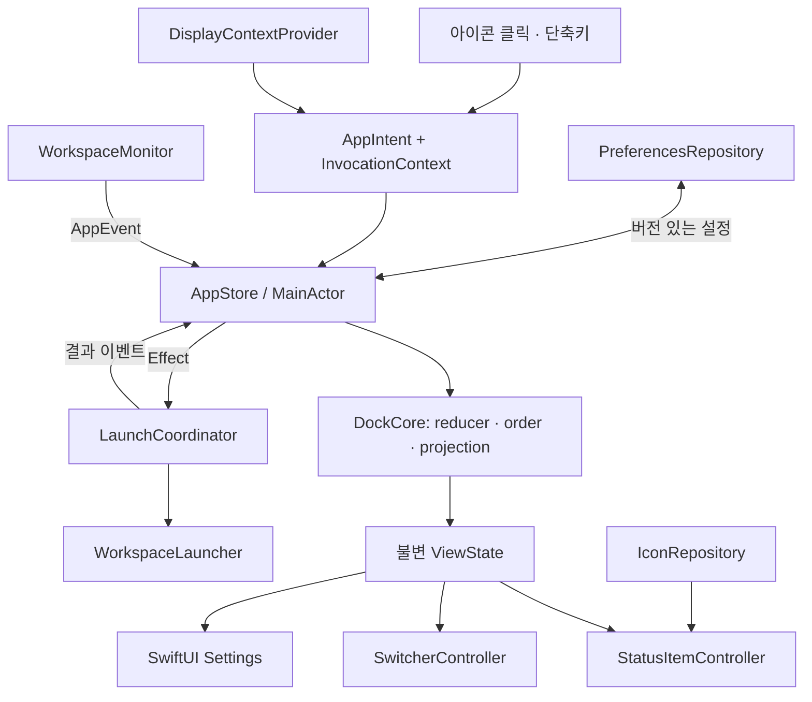

# 기술 스택과 아키텍처

작성: 2026-09-28 · 상태: 구현을 위한 설계안

## 1. 제품의 기준

목표는 **순서와 모양이 안정적이고, 마우스와 키보드로 빠르게 앱을 여는 메뉴 막대 런처**다. 기존 앱의 기능을 모두 복제하기보다 아래 사용자 요구를 우선한다.

| 요구 | 첫 버전의 결정 |
| --- | --- |
| 앱 순서가 자꾸 바뀜 | 저장된 사용자 순서를 기준으로 표시. 활성화/실행 이벤트가 순서를 바꾸지 않음 |
| 첫 실행에 중간 padding 발생 | 단일 메뉴 막대 항목 안에서 필요한 아이콘만 배치. 빈 슬롯 및 자동 구분선 없음 |
| 비활성 디스플레이에서 색상/대비 깨짐 | 시스템 외관을 상속하고 실제 화면 배율로 렌더링. 다중 화면 실기기 검증을 출시 조건으로 설정 |
| 좁은 공간 | 실행 중 점·밑줄·배지 없음. 상태 추적은 실행/활성화 판단에만 사용 |
| 키보드 조작 | Option+Tab / Shift+Option+Tab 이동, Enter 실행, Esc 취소 |
| 새 앱의 실행 화면 지정 | 사용자 요청으로 제외. 초기 창 위치는 macOS/대상 앱에 맡김 |
| 이미 실행 중인 앱 | 기존 창을 활성화하고 위치는 유지 |

기본 표시 집합은 고정한 앱과 실행 중인 일반 앱의 합집합이다. 고정한 앱은 종료돼도 표시하고, 고정하지 않은 앱은 종료되면 표시 집합에서 빠진다. 어느 경우에도 나머지 앱의 상대적 순서는 유지한다. 실행 중 앱 자동 추가는 설정에서 끌 수 있다.

첫 버전에서 제외: 타 앱 창의 디스플레이 간 자동 이동, 창 미리보기, 알림 배지, 창별 목록, 다른 앱의 메뉴 막대 아이콘 관리, 현재 Space별 앱 필터링, 클라우드 동기화, Intel 지원, 임의 앱의 새 창 만들기 자동화. 사용자가 요청한 실행 중 표시는 제외하며 이를 위한 공간도 예약하지 않는다.

## 2. 기술 스택

| 영역 | 선택 | 이유 |
| --- | --- | --- |
| 언어 | Swift 6 language mode, Swift 6.2+ 도구 체인 | 명시적 동시성 격리, AppKit과 직접 연동 |
| 실행 환경 | macOS 14+, arm64 | 구형 macOS 호환 분기를 줄이고 Apple Silicon 실기기에 검증 집중 |
| 앱 수명주기 | AppKit `NSApplicationDelegate`, `LSUIElement` | 일반 Dock 아이콘 없이 메뉴 막대 상주. 재실행 시 설정 창 복구 |
| 메뉴 막대 | `NSStatusItem` 하나 + AppKit 아이콘 strip | 순서·간격을 한 곳에서 관리, 클릭/우클릭/키보드 접근성 제어 |
| 선택 패널 | `NSPanel` + AppKit 뷰 | 키 입력, 포커스 반환, 디스플레이 좌표를 명시적으로 제어 |
| 설정 화면 | SwiftUI + Observation, AppKit window host | 설정 폼·목록 구현을 단순화. 열 때 지연 생성 |
| 앱 감지/실행 | `NSWorkspace`, `NSRunningApplication` | 프로세스 변화 알림, 실행 및 활성화 |
| 전역 단축키 | KeyboardShortcuts 3.1.0, SPM | 단축키 등록·설정 UI. 직접 event tap을 유지하지 않음 |
| 자동 시작 | `SMAppService.mainApp` | 별도 로그인용 Launcher 앱 없이 등록 |
| 저장 | Codable JSON + atomic file replacement | 순서·고정 앱·설정의 버전 관리와 손상 복구 |
| 진단 | `Logger`, `OSSignposter`, Instruments | 이벤트→화면 갱신, 실행 요청 시간과 CPU/메모리 측정 |
| 테스트 | Swift Testing + XCTest/XCUITest | 순수 정책 테스트와 macOS 통합·성능 테스트 분리 |
| 빌드 | Xcode app target + 로컬 Swift Package | 앱 번들/서명은 Xcode, 핵심 로직은 독립 테스트 |
| 배포 | Developer ID + Hardened Runtime + 공증 | 앱 정상 종료 기능을 포함한 직접 배포 |
| 업데이트 | 배포 단계에서 Sparkle 2.10.0, SPM | 검증된 업데이트 체계. 초기 프로토타입에는 넣지 않음 |

외부 런타임 의존성은 우선 KeyboardShortcuts 하나다. Sparkle은 배포 단계에서 추가한다. 위 버전은 조사 시점에 확인한 버전이며 도입할 때 호환성·릴리스를 다시 확인하고 `Package.resolved`를 커밋한다. KeyboardShortcuts 3.1.0의 manifest가 Swift tools 6.2를 요구한다. [버전/manifest](https://github.com/sindresorhus/KeyboardShortcuts/blob/3.1.0/Package.swift), [Sparkle manifest](https://github.com/sparkle-project/Sparkle/blob/2.10.0/Package.swift).

Swift 6의 격리는 데이터 경쟁을 줄이는 수단이며 이벤트 순서 오류까지 해결하지는 않는다. 후자는 아래 상태 전이 규칙과 테스트로 방지한다. [Swift 동시성](https://docs.swift.org/swift-book/documentation/the-swift-programming-language/concurrency/).

Electron/Tauri는 이 앱의 핵심인 macOS 창·메뉴 막대 제어에도 네이티브 연결 코드가 필요하므로 선택하지 않는다. Rust/Metal/별도 데이터베이스도 현재 작업량에 필요하지 않다. `MenuBarExtra`만으로 구현하면 여러 아이콘의 직접 클릭과 세밀한 포커스 처리를 위해 다시 AppKit 연결이 필요해 AppKit을 중심으로 둔다.

## 3. 전체 구조

단일 앱 프로세스, 하나의 상태 저장소, 기능별 어댑터로 구성한다. 자체 daemon이나 XPC helper는 첫 버전에 만들지 않는다. Sparkle이 배포 시 사용하는 내부 구성요소는 별개다.



| 구성요소 | 책임 | 책임 범위 밖 |
| --- | --- | --- |
| `DockCore` | 식별자, 순서, reducer, 표시 목록, 선택 세션 | AppKit 객체, 파일/프로세스 접근 |
| `AppStore` | 직렬 이벤트 처리, state revision, effect 시작/취소 | 화면 좌표로 정렬, 직접 OS 호출 |
| `WorkspaceMonitor` | 스냅샷·앱 실행/종료/활성화 이벤트 정규화 | 표시 순서 결정 |
| `StatusItemController` | 단일 항목 소유, diff 적용, 접근성 | 앱 목록 직접 조회 |
| `SwitcherController` | 패널·선택 세션·로컬 키 입력 | 실제 앱 실행 정책 |
| `LaunchCoordinator` | 기존/새 실행 판정, 중복 실행 방지, 결과 추적 | 창 그리기 |
| `DisplayContextProvider` | 선택 패널을 놓을 화면, 화면 목록/배율 변화 | 타 앱의 창 위치 조회·변경 |
| `PreferencesRepository` | 버전·검증·원자 저장·복구 | 실행 중 프로세스 영속화 |
| `IconRepository` | 아이콘 캐시·변경 무효화 | 공유 NSImage 수정 |

의존성은 생성자에서 주입한다. 서비스 locator나 전역 mutable singleton을 만들지 않는다. 인터페이스는 OS 경계와 저장 경계에만 두며, 작은 값 타입까지 protocol로 나누지 않는다.

## 4. 상태와 이벤트 규칙

### 식별자

- `AppID`: 앱 설치 항목에 부여한 영속 UUID. 표시명이나 PID를 쓰지 않는다.
- `AppLocator`: bookmark, 마지막 확인 URL, bundle identifier. bookmark 우선 복원 후 유효한 번들을 검사한다.
- 같은 bundle identifier의 다른 설치 경로는 서로 다른 앱으로 취급한다. bundle identifier만으로 합치거나 다른 버전을 실행하지 않는다.
- 경로 이동/업데이트 시 bookmark를 갱신한다. 복원이 안 되고 후보가 여러 개면 사용자가 다시 지정한다.
- `ProcessID`: PID + launchDate 또는 관찰 세대. PID 재사용에 대비하며 앱 하나에 여러 프로세스를 연결할 수 있다.
- URL/식별자를 얻지 못한 실행 앱은 세션용 ID로만 관리한다. 공통 문자열 `UNKNOWN`으로 합치지 않는다.

### 저장소의 주요 필드

`catalog`, `processesByApp`, `orderedAppIDs`, `pinnedAppIDs`, `excludedAppIDs`, `frontmostProcess`, `preferences`, `switcherSession`, `pendingLaunches`, `revision`.

`orderedAppIDs`는 사용자가 지정한 순서다. 실행 상태와 독립이다. 새로 발견한 앱만 끝에 추가하며 자동 활성화/MRU 정렬을 기본 기능으로 넣지 않는다. 삭제된 앱의 위치 기록은 bounded history로 남겨 재실행 시 상대 순서를 복구한다. 고정 앱 기록은 유지하고, 고정하지 않은 오래된 기록은 90일/256개 상한으로 정리하는 초기 정책을 둔다.

### 반드시 지킬 규칙

1. 실행·활성화·숨김 이벤트는 기존 앱 간의 상대 순서를 변경하지 않는다.
2. 고정 앱과 실행 앱의 중복은 한 번만 표시한다. 두 그룹 사이 구분선도 만들지 않는다.
3. `frontmostProcess`는 표시 대상 필터보다 먼저 갱신한다. accessory 앱이 활성화돼도 이전 앱을 활성 상태로 남기지 않는다.
4. 활성화 알림의 payload를 사용하고 같은 callback 안에서 `frontmostApplication`을 재조회해 payload를 버리지 않는다.
5. 상태 변경은 `@MainActor`에서 직렬로 처리한다. UI는 projection 결과만 읽는다.
6. 여러 이벤트를 버리지 않고 순서대로 reduce하되 렌더링은 한 run loop에서 합칠 수 있다. 사용자 클릭/키 입력을 debounce하지 않는다.
7. 요청 ID와 revision을 사용해 늦게 온 아이콘·실행·저장 결과가 최신 상태를 덮어쓰지 못하게 한다.
8. 동작 대상은 화면의 index가 아니라 `AppID`다. 마우스를 누르는 순간 대상 ID를 고정한다.

### 시작·복구

설정 로드 → 관찰자 등록 → 초기 프로세스 스냅샷 → 대기 중 이벤트 병합 → 첫 표시 목록 생성 → 메뉴 막대 항목 게시 순서다. 준비 중에는 별도 일반 창 없이 런처 glyph 하나만 허용한다. 앱 개수에 맞춘 빈 슬롯을 미리 만들지 않는다.

이벤트를 놓치지 않도록 관찰자 수명과 해제를 명시적으로 소유한다. 실행/종료는 `runningApplications` KVO와 workspace 알림을 중복 제거해 처리하고, 활성화·숨김·해제는 workspace notification center에서 받는다. background/LSUIElement 앱은 실행/종료 알림에 포함되지 않을 수 있기 때문이다. 전체 스냅샷 재조정은 시작, wake, session 복귀, 불일치 감지 시 수행하며 주기 polling을 하지 않는다. [실행 앱 KVO](https://developer.apple.com/documentation/appkit/nsworkspace/runningapplications), [종료 알림의 제한](https://developer.apple.com/documentation/appkit/nsworkspace/didterminateapplicationnotification).

## 5. 메뉴 막대와 다중 디스플레이 렌더링

`NSStatusItem` 하나를 앱 수명 동안 유지하고 `autosaveName`을 고정한다. macOS가 항목의 외부 위치를 관리하고 앱은 내부 아이콘의 순서만 관리한다. Command+drag는 strip 전체를 옮기고, 개별 앱 순서는 설정 목록에서 drag로 바꾼다. 첫 버전의 직접 strip drag는 필수가 아니다. [NSStatusItem](https://developer.apple.com/documentation/appkit/nsstatusitem).

**렌더러 우선 후보**는 아이콘 strip을 하나의 이미지로 합성해 표준 `NSStatusBarButton.image`에 전달하는 방식이다. 아이콘 rect→AppID 매핑으로 클릭을 분리하고 각 앱의 접근성 요소도 제공한다. 데이터가 바뀔 때만 작은 strip 이미지를 재생성한다. 직접 image subview를 추가하는 방식은 표준 이미지 경로와 비교 검증할 대안으로 둔다. deprecated `NSStatusItem.view` 교체, private window 접근, view hierarchy의 force unwrap, 화면 x좌표 정렬은 사용하지 않는다. 비활성 디스플레이 합성·Command+drag·아이콘별 VoiceOver 동작을 함께 통과해야 렌더러를 확정한다.

사용자 제공 [비활성 화면 참고 이미지](assets/inactive-display-reference.png)에서는 앱 아이콘의 밝은 부분이 흰색에 가깝게 번지고 색이 청록색 쪽으로 치우쳐 보인다. 이를 R3 회귀 사례로 삼는다. 이미지 하나만으로 `.aqua` 또는 subview 합성이 원인이라고 확정하지 않는다. 같은 아이콘·배경·배율에서 활성/비활성 화면을 번갈아 비교해 확인한다.

- 아이콘은 full-color 원본 복사본을 사용하고 template tint를 강제하지 않는다.
- `.aqua`/`.darkAqua`를 강제 지정하지 않는다. `effectiveAppearance`와 실제 button bounds를 사용한다.
- 배경은 시스템 메뉴 막대에 맡긴다. 별도 대비 필터, 항상 active인 material, 고정 검정/흰 배경을 얹지 않는다.
- 배율과 외관 변경 시 파생 캐시를 무효화한다. 1x/2x 표현을 제공하고 공유 `NSImage.size`를 수정하지 않는다.
- 고정 22pt 높이 계산을 없애고 실제 높이 안에 아이콘을 중앙 정렬한다. 실행 중 표시 공간은 없다.
- 시스템의 비활성 메뉴 막대 dimming은 허용한다. 사용자 설정을 무시한 강제 밝기 보정은 하지 않는다.
- display attach/detach, backing scale, appearance, 접근성 대비·투명도 변경을 반영한다.
- 각 아이콘을 접근성 버튼으로 노출하고 앱 이름·실행 action·우클릭 메뉴에 접근할 수 있게 한다.

초기 레이아웃 값은 아이콘 18pt, 간격 4pt, 양끝 3pt, 최대 6개를 제안한다. 값은 검증 후 조정하고 설정으로 변경할 수 있다. 폭은 `양끝 여백 + 아이콘 수 × 아이콘 폭 + 사이 간격 + 필요한 경우 overflow 폭`으로 계산한다. 앱이 줄면 즉시 정확한 폭으로 줄고 빈 재사용 슬롯이 남지 않는다.

넘친 앱은 overflow 메뉴/선택 패널에 둔다. compact 모드는 런처 glyph 하나만 보여준다. 앱이 0개일 때도 glyph로 설정과 종료에 접근할 수 있다. Finder에서 앱을 다시 열면 설정 창이 나타나도록 해 메뉴 막대가 가려져도 복구 경로를 제공한다.

**노치의 제약:** `isVisible == true`라도 공간 부족으로 항목이 화면에서 숨겨질 수 있다. 따라서 이 속성으로 정확한 남은 폭이나 가림을 판단하지 않는다. 사용자가 정한 개수/최대 폭과 compact 모드로 제한한다. 한 항목 전체가 숨겨질 수 있는 위험을 첫 실행 안내와 단축키/재실행 복구 경로로 보완한다. 디스플레이마다 별도 status item을 생성해 특정 화면에 강제 배치하지 않는다. [Apple의 isVisible 설명](https://developer.apple.com/documentation/appkit/nsstatusitem/isvisible).

## 6. Option+Tab 선택 동작

| 입력 | 동작 |
| --- | --- |
| Option+Tab | 선택 패널을 열고 현재 앱의 다음 항목 선택. 열린 상태에서는 다음 항목 |
| Shift+Option+Tab | 이전 항목. 처음 호출한 경우 현재 앱의 이전 항목 |
| 좌/우 방향키 | 패널 안에서 이전/다음 |
| Enter/Return, keypad Enter | 선택한 앱 실행 또는 활성화, 패널 닫기 |
| Esc | 실행하지 않고 닫기 |
| Option 해제 | 자동 확정하지 않음. Enter를 기다림 |

현재 앱이 목록에 없으면 정방향은 첫 항목, 역방향은 마지막 항목부터 시작한다. 끝에서는 순환한다. 목록이 비면 빈 상태와 설정 열기를 제공하고 Enter는 실행하지 않는다.

전역 등록은 정방향/역방향 조합만 담당한다. Enter/Esc/화살표는 key panel의 로컬 입력으로만 받는다. global callback과 panel keyDown이 같은 Option+Tab 입력을 이중 처리하지 않도록 그 조합은 전역 경로 하나만 사용한다. 반복 입력 지원은 해당 라이브러리의 단일 반복 스트림으로 통일한다. 다른 앱과 충돌하면 등록 실패를 표시하고 재지정할 수 있게 한다. 모든 타 앱의 단축키 충돌을 사전에 알 수 있다고 가정하지 않는다. [KeyboardShortcuts](https://github.com/sindresorhus/KeyboardShortcuts).

`SwitcherSession`은 시작 시 항목 ID 순서와 호출 화면을 캡처한다. 선택 중 launch/activate 이벤트가 들어와도 선택이 튀지 않는다. 항목이 제거되면 세션에서 제외하고, 선택 대상이 사라지면 다음 유효 항목으로 이동한다. 새 앱은 다음 세션에 추가한다.

패널은 `NSPanel.nonactivatingPanel` 기반으로 생성할 때부터 스타일을 고정하고, `canBecomeKey = true`, `canBecomeMain = false`로 설계한다. 호출 직전 앱과 화면을 저장하고 Esc에서는 원래 작업 흐름으로 돌아간다. fullscreen/Spaces/Stage Manager 조합에서 key 입력과 focus 복구를 검증한다. 특정 OS에서 부적합하면 활성화하는 패널과 명시적 focus 반환 방식으로 바꾸며 기능 요구는 유지한다. [NSPanel 스타일](https://developer.apple.com/documentation/appkit/nswindow/stylemask-swift.struct/nonactivatingpanel).

## 7. 앱 실행과 선택 패널의 화면

사용자 요청에 따라 **새 앱을 현재 디스플레이로 옮기는 기능은 제외**한다. 창 생성 관찰, 창 위치 변경, 손쉬운 사용 권한 요청을 구현하지 않는다. 다중 디스플레이의 메뉴 막대 외관 개선은 유지한다.

| 요청 당시 상태 | 처리 |
| --- | --- |
| 해당 설치 앱이 실행 중 | 기존 프로세스 활성화. 창 위치는 유지 |
| 앱이 완전히 종료됨 | `NSWorkspace.openApplication`으로 실행. 초기 창 위치는 OS/대상 앱이 결정 |
| 실행 중이나 창이 없음 | 정상 reopen/activate 요청. 대상 앱이 지원하는 기본 동작 사용 |
| 실행 요청 중 다시 클릭 | 기존 요청에 합류. 중복 실행하지 않음 |
| 실행 결과를 아직 알 수 없음 | 요청을 추적하고 reconcile. timeout만으로 다시 실행하지 않음 |

`LaunchCoordinator`는 요청 ID, 설치 ID, 실행 직전 프로세스 집합을 저장한다. 선택한 설치 경로를 지키도록 `allowsRunningApplicationSubstitution`을 명시적으로 false로 두고 `createsNewApplicationInstance`도 false로 둔다. 실행 중이면 클릭 당시 `AppID`에 연결된 프로세스를 다시 확인해 활성화한다. 여러 인스턴스가 있으면 마지막으로 활성화된 유효 인스턴스를 선택한다. [OpenConfiguration](https://developer.apple.com/documentation/appkit/nsworkspace/openconfiguration).

우리 앱의 선택 패널은 호출 시 마우스가 있는 화면에 표시한다. 메뉴 막대 overflow에서 열면 클릭한 화면을 사용한다. 화면과 마우스 위치는 패널을 여는 순간 한 번만 읽고 세션 동안 유지한다. 이는 다른 앱의 활성 창 화면을 판별한다는 의미가 아니다. 화면이 분리되면 패널을 닫고 다음 호출 때 화면 목록을 다시 읽는다. 타 앱 창을 조사하는 권한이나 mouse polling은 필요하지 않다.

## 8. 경계 계약과 실패 처리

다음은 구현 파일이 아닌 인터페이스 수준의 계약이다.

```text
WorkspaceMonitor: start(emit AppEvent) / stop() / reconcile(reason)
DockReducer: (DockState, DockEvent) -> (DockState, [Effect])
DockProjection: (DockState, LayoutBudget) -> DockViewState
DisplayContextProvider: capture(input) -> InvocationContext
AppCommander: perform(AppIntent, InvocationContext) -> CommandOutcome
PreferencesRepository: load() / save(document, revision)
IconRepository: icon(AppID, size, scale, appearance) -> IconHandle
```

- `AppIntent`: open, hide, unhide, quit, pin, unpin, reorder, exclude.
- `CommandOutcome`: activated / launched(process) / requestAccepted / failed(error) / unknown.
- `AppError`: appMissing / invalidBundle / launchFailed / activationRejected / shortcutUnavailable / preferencesUnreadable / preferencesWriteFailed.

실행 요청 전달과 실제 프로세스 시작은 구분한다. timeout을 실패 확정으로 취급하지 않고 늦은 프로세스 시작을 reconcile한다. quit의 Bool은 요청 전달 성공이며 실제 종료는 이벤트로 확인한다. 저장되지 않은 문서 때문에 종료가 취소되면 실행 상태를 유지한다. [terminate 계약](https://developer.apple.com/documentation/appkit/nsrunningapplication/terminate()).

단순 상태 오류는 메뉴/설정 내 피드백으로 보여준다. 실행 요청 실패는 선택 패널에서 재시도/경로 다시 지정을 제공한다. 성공 여부를 확인할 수 없는 activation을 성공으로 꾸미지 않는다. macOS의 activation은 요청이며 항상 성공하지 않으므로, deprecated ignoring-other-apps 옵션이나 반복 focus 탈취를 기본 전략으로 쓰지 않는다. [macOS activation 변경](https://developer.apple.com/documentation/macos-release-notes/appkit-release-notes-for-macos-14).

## 9. 저장·보안·배포

`Application Support/<bundle-id>/preferences.json`에 schemaVersion, 설치 항목, 순서, 고정/제외 앱, 간격/표시 개수, 단축키 설정을 저장한다. 단축키 라이브러리에도 별도 진실을 두지 않고 custom binding 저장 방식을 사용한다. 로그인 항목의 실제 활성 여부는 `SMAppService.status`에서 읽는다.

- 설정 변경 후 짧게 합쳐 원자 저장하며 종료 시에만 저장하지 않는다.
- 저장 revision을 직렬 처리해 오래된 저장이 새 상태를 덮지 않게 한다.
- 알려진 schema만 migrate한다. 미래 schema는 원본을 보존하고 덮어쓰지 않는다.
- 손상된 파일은 보존하고 마지막 정상 백업/기본값으로 복구한다. 저장 오류를 숨기지 않는다.
- 아이콘, PID, 현재 활성 앱, 패널 선택 상태는 영속 설정에 넣지 않는다.
- 앱 이름·창 제목·파일 경로는 기본 진단 로그에 평문으로 남기지 않는다. 성능 로그는 요청 ID, 단계, 시간, 결과 코드 중심이다.

타 앱의 정상 종료 기능 때문에 초기 배포는 App Sandbox를 켜지 않은 Developer ID 배포를 선택한다. Hardened Runtime과 공증은 유지한다. 손쉬운 사용, 관리자 권한, 화면 기록, 전체 디스크 접근, 일반 키보드 입력 감시는 요구하지 않는다. 자신의 버튼을 VoiceOver에 노출하는 접근성 지원은 타 앱 제어 권한과 별개다. App Store 버전이 필요해지면 기능과 권한 모델을 별도 검토한다. [App Sandbox의 제한](https://developer.apple.com/documentation/security/protecting-user-data-with-app-sandbox).

## 10. 성능 목표와 확인 방법

아래는 **미측정 설계 목표**다. 동일한 Apple Silicon 실기기와 Release arm64 빌드에서 기준선을 만든 후 조정한다. arm64 포함만으로 최적화 완료라고 판단하지 않는다.

| 항목 | 초기 목표 / 측정 조건 |
| --- | --- |
| idle | 30개 앱을 관찰하고 사용자 활동이 없는 60초 구간, 1코어 기준 평균 CPU 0.1% 이하 지향 |
| 상주 메모리 | 설정/패널을 닫고 아이콘 cache warm 상태에서 physical footprint 80MiB 이하 지향 |
| 자체 반복 작업 | 앱 목록·마우스 위치 polling 0, idle display link/타이머 0. 업데이트 일정 및 요청별 timeout은 별도 |
| 상태→표시 | 30개 앱 시나리오의 이벤트 수신→diff 반영 p95 16ms 이하 |
| 입력 반응 | warm Option+Tab→패널 표시 p95 100ms 이하 |
| 실행 전달 | click/Enter→NSWorkspace 요청 p95 50ms 이하. 대상 앱의 실제 시작 시간은 별도 |
| 캐시 | 아이콘 캐시 비용 상한 16MiB, 중복 요청 병합, 변경된 항목만 다시 생성 |
| 장시간 사용 | 실행/종료·설정 열고 닫기·화면 연결 반복 후 observer와 메모리 수가 계속 증가하지 않음 |

작은 reducer 연산은 MainActor에서 수행하고 파일 I/O를 분리한다. `NSImage` 등 AppKit 객체를 actor 사이에 무검증 전달하지 않는다. UI 렌더링을 제외한 무거운 변환은 Sendable 데이터로 경계를 나누고 제한된 작업 수로 처리한다. CPU core affinity나 무조건적인 병렬화는 사용하지 않는다.

`OSSignposter` 구간은 event-to-render, switcher-open, launch-request, process-observed로 나눈다. 타 앱의 시작 시간과 우리 실행 요청 전달 비용을 구분한다. Swift Testing은 정책·이벤트 재생, XCTest는 성능, 실제 두 화면 수동 검증은 외관·Spaces를 담당한다. [XCTest 성능 측정](https://developer.apple.com/documentation/xcode/writing-and-running-performance-tests).

## 11. 코드 배치 제안

```text
MenuBarDock.xcodeproj
App/
  AppDelegate.swift              # composition root, LSUIElement lifecycle
  AppStore.swift
  StatusBar/                    # status item, strip, context menu
  Switcher/                     # panel, key routing, session presentation
  Settings/                     # SwiftUI views
  Resources/
Packages/MenuBarDockKit/
  Package.swift
  Sources/DockCore/              # Foundation 값 타입과 순수 정책
  Sources/MacIntegration/        # Workspace, Display, Icons, Login
  Sources/Persistence/           # 설정 schema, migration, atomic storage
  Tests/DockCoreTests/
  Tests/PersistenceTests/
Tests/IntegrationTests/          # controlled fixture apps 포함
Tests/UITests/
Config/                         # Debug/Release xcconfig, entitlements
scripts/                        # build, architecture check, notarization
docs/
```

처음부터 더 많은 package나 서비스로 나누지 않는다. `DockCore`는 다른 로컬 target을 참조하지 않고, MacIntegration과 Persistence가 DockCore를 참조하며, App이 모두를 조립한다. 실제 app bundle ID/서명 팀과 Xcode 버전은 구현 시작 시 고정한다.

현재 개발 환경은 arm64 macOS 27.0, Swift 6.4 CLI가 확인되었으나 활성 developer directory는 CommandLineTools여서 `xcodebuild`를 사용할 수 없다. 설계 작성에는 영향이 없으며 앱 빌드/서명/UI 테스트를 시작할 때 전체 Xcode 경로를 준비해야 한다.
