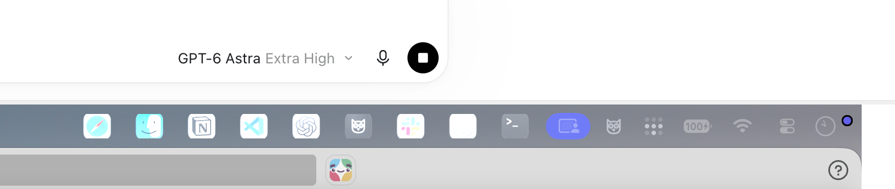

# 기존 앱 조사

조사일: 2026-09-28. 읽기 전용 소스 조사 및 배포 실행 파일의 아키텍처 확인이며, 사용자가 설치한 버전에 대한 실행 중 profiling은 수행하지 않았다.

대상 소스: [EthanSK/Menu-Bar-Dock, ffc13de58ec40d3dab913ca36cc1155f24a68099](https://github.com/EthanSK/Menu-Bar-Dock/tree/ffc13de58ec40d3dab913ca36cc1155f24a68099).

현재 작업 저장소는 `jeonghyeon-net/menubar-dock`이며 조사 시작 시 파일과 commit이 없었다. 원본은 임시 디렉터리에 조회했고 새 저장소에 복사하지 않았다.

## 확인된 사실

| 항목 | 확인 결과 |
| --- | --- |
| 기존 기술 | Swift 5 mode, AppKit, storyboard, CocoaPods |
| 최소 OS | 앱 target macOS 10.15 |
| 로그인 | 별도 Launcher와 구형 OS 분기 유지 |
| 업데이트 | Sparkle 2.6.4 |
| 메뉴 막대 | 앱별 `NSStatusItem`을 pool로 만들고 좌표 순서대로 재배열 |
| 빈 항목 | 항목을 제거하지 않고 길이를 0으로 축소하는 경로 존재 |
| 외관 | `.aqua` 강제 설정, 22pt 높이 가정, 갱신마다 image subview 교체 |
| 앱 상태 | workspace 활성화/종료 알림 기반. 이미 이벤트 기반이므로 “polling 앱”이라고 평가하지 않음 |
| 테스트 | 배열 정렬과 메뉴 항목 순서 테스트는 존재. UI·다중 디스플레이 외관의 충분한 회귀 검증은 확인되지 않음 |

## Apple Silicon 지원 여부

[v4.7.9 배포본](https://github.com/EthanSK/Menu-Bar-Dock/releases/tag/v4.7.9)의 `Menu-Bar-Dock-v4.7.9.zip`을 받아 실행하지 않고 Mach-O header를 검사했다.

```text
zip SHA-256
932dcc156a5c1aba468f799344e6aaa4ca8e55dafe7a30a506b0567a408f332d

Menu Bar Dock.app/Contents/MacOS/Menu Bar Dock
Mach-O universal binary: x86_64 + arm64
```

배포본의 Launcher 및 확인한 Sparkle helper 실행 파일에도 arm64가 있었다. 사용자가 설치한 버전은 별도로 확인하지 않았다. 따라서 최신 배포본이 Apple Silicon 네이티브를 지원하지 않는다는 가설은 맞지 않는다. CPU/메모리/전력 최적화 여부는 이 검사로 판단할 수 없다.

## 사용자 증상과 설계에 반영한 근거

### 순서와 빈 여백

[`MenuBarItems.swift`](https://github.com/EthanSK/Menu-Bar-Dock/blob/ffc13de58ec40d3dab913ca36cc1155f24a68099/MenuBarDock/MenuBarItems.swift#L38)의 주석에는 길이 0인 항목 때문에 빈 간격이 남고, visibility를 끄면 위치 복원이 깨진다는 문제가 기록돼 있다. 같은 파일은 실제 화면 좌표로 항목을 정렬하고 여분 항목을 유지한다.

새 설계는 status item 한 개 안에 배열을 배치한다. 저장 순서와 화면 레이아웃을 분리하고, 항목 수와 정확히 일치하는 폭만 사용한다. 사용자 증상과 구조가 부합하지만, 첫 부팅 증상의 정확한 재현 원인을 확정한 것은 아니다.

### 비활성 디스플레이 외관

사용자가 제공한 아래 이미지에서 앱 아이콘의 흰색 영역이 과도하게 밝고 청록색 계열로 색이 치우쳐 보이는 현상을 확인했다. 이미지로 증상을 확인했으며 실행 환경에서 원인을 재현한 것은 아니다.



[`MenuBarItem.swift`](https://github.com/EthanSK/Menu-Bar-Dock/blob/ffc13de58ec40d3dab913ca36cc1155f24a68099/MenuBarDock/MenuBarItem.swift#L44)에는 고정 높이, 이미지 객체 크기 변경, subview 교체, `.aqua` 지정이 있다. 다중 화면에서 외관/배율 불일치를 만들 수 있는 후보이며 인과관계는 실기기 재현으로 확인해야 한다.

원본에는 [외부 디스플레이에서 아이콘 압축 보고 #39](https://github.com/EthanSK/Menu-Bar-Dock/issues/39)도 있다. 이 보고가 사용자의 대비 깨짐과 같은 버그라는 뜻은 아니다. 새 설계는 두 경우를 별도 회귀 시나리오로 다룬다.

### 활성 앱 상태

[`AppTracker.swift`](https://github.com/EthanSK/Menu-Bar-Dock/blob/ffc13de58ec40d3dab913ca36cc1155f24a68099/MenuBarDock/AppTracker.swift)는 activation policy가 regular인 앱만 delegate에 전달한다. [`RunningApps.swift`](https://github.com/EthanSK/Menu-Bar-Dock/blob/ffc13de58ec40d3dab913ca36cc1155f24a68099/MenuBarDock/RunningApps.swift)는 마지막 활성 앱을 이용해 필터링한다. 표시하지 않는 accessory 앱이 활성화됐을 때 상태가 뒤처질 수 있는 경계다.

새 설계는 이벤트 수집과 표시 필터를 분리하고 frontmost 상태를 먼저 갱신한다. 사용자 요청에 따라 실행 중 상태를 메뉴 막대에 시각적으로 표시하지는 않는다.

### 식별과 실행

[`RunningApp.swift`](https://github.com/EthanSK/Menu-Bar-Dock/blob/ffc13de58ec40d3dab913ca36cc1155f24a68099/MenuBarDock/RunningApp.swift#L13)는 URL 문자열 또는 공통 `UNKNOWN`을 ID로 사용한다. [`OpenableApp.swift`](https://github.com/EthanSK/Menu-Bar-Dock/blob/ffc13de58ec40d3dab913ca36cc1155f24a68099/MenuBarDock/OpenableApp.swift#L141)의 일반 실행 경로는 callback 오류를 사용하지 않는다.

새 설계는 설치 ID와 프로세스 ID를 분리하고 launch/activation 결과를 각각 추적한다. 새 앱의 실행 화면 지정은 사용자 요청으로 제외했으며, 기존/새 앱 모두 창 위치를 직접 조정하지 않는다.

## 재사용 원칙

조사한 tree에서는 LICENSE/COPYING 파일을 찾지 못했다. 구현과 에셋은 새로 작성하고 원본 코드를 복사하는 계획은 두지 않는다. 기존 앱의 동작과 이슈는 요구사항·회귀 사례의 참고 자료로 사용한다.

원본에 대한 성능 저하, 전체 crash 원인, 모든 디스플레이 버그가 확정됐다고 주장하지 않는다. 새 구현도 [검증 계획](implementation-plan.md)의 실기기 조건을 통과해야 한다.
