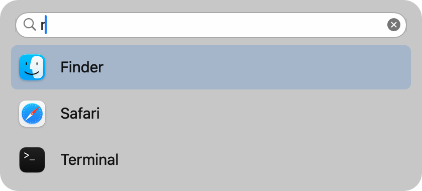

# 사용 설명

개발 중인 1.0.4의 사용법입니다. 현재 공개된 v1.0.3과 설정 목록·검색 기능이 다릅니다.

## 설치와 시작

DMG를 연 뒤 Menu Bar Dock을 Applications 폴더로 옮겨 실행합니다. 소스에서 만들려면 [시작하기](../README.md#시작하기)를 따릅니다. 처음 실행하면 설정이 나타납니다. 기존 EthanSK 앱을 함께 실행하면 두 앱이 각각 아이콘을 표시하므로 기존 앱은 직접 종료해 주세요. 이 앱은 기존 앱의 설정을 수정하지 않습니다.

로컬에서 빌드한 앱은 ad-hoc 서명입니다. Developer ID로 서명하고 Apple 공증을 받은 배포본과 구별해야 합니다. 공증되지 않은 다운로드 앱의 실행 여부는 macOS 보안 정책이 결정합니다.

## 앱과 순서

메뉴 막대에는 **앱 아이콘만** 표시합니다. 각 아이콘을 왼쪽 클릭하면 앱을 실행하거나 기존 앱으로 전환합니다. 이미 실행 중인 앱은 해당 설치본을 활성화하며 창 위치를 직접 변경하지 않습니다.

설정을 열려면 메뉴 막대 앱 아이콘을 우클릭하고 **설정…** 항목을 선택합니다. Control-클릭도 같은 메뉴를 엽니다. 왼쪽 클릭만 사용하려면 Finder에서 **Menu Bar Dock을 다시 실행**하거나, **Option+Tab** 선택 패널의 **톱니 버튼을 왼쪽 클릭**합니다. 표시 중인 아이콘이 없어도 이 방법으로 설정을 열 수 있습니다. 앱 목록, 크기, 자동 표시, 로그인 시작과 단축키를 한 창에서 조절합니다.

설정 위쪽의 **항상 표시할 앱** 목록에서 앱과 순서를 관리합니다. 목록에 넣은 앱은 종료 후에도 메뉴 막대와 선택 패널에 남습니다. 고정·표시 여부를 따로 체크할 필요가 없습니다.

| 조작 | 동작 |
| --- | --- |
| 행 클릭 | 관리할 앱 선택. 두 번 클릭하면 앱 열기 |
| `+` | 설치된 `.app`을 목록 끝에 추가. 여러 앱 선택 가능하며 종료 후에도 표시 |
| `−` | 선택한 앱을 목록에서 제거. 실행 중이어도 행이 사라지고 자동 감지·재실행으로 다시 추가되지 않음. `+`로 복원 가능 |
| `↑`·`↓` 또는 행 드래그 | 등록한 앱 사이의 순서 변경·저장 |
| 하단 더 보기 버튼 | **Finder에서 보기**, **앱 위치 다시 지정…** |

목록에는 앱 이름을 표시합니다. 이름 위에 포인터를 올리면 설치 경로를 확인할 수 있습니다. 앱을 옮겼을 때는 저장된 위치 정보로 복원을 시도하며, 찾지 못하면 **앱 위치 다시 지정…** 항목에서 새 위치를 선택합니다. 앱 실행과 전환은 저장된 순서를 바꾸지 않습니다.

실행 중인 앱의 아이콘을 우클릭하고 **목록에 추가**를 선택해도 목록 끝에 등록됩니다. 이미 등록한 앱의 메뉴에는 **목록에서 제거**가 표시되며, 설정의 `−`와 같이 메뉴 막대와 설정 목록에서 제거합니다.

  

## 실행 중인 앱 자동 감지

시작할 때 macOS Dock에 고정한 앱과 Finder를 가져옵니다. 실행하지 않은 앱도 포함됩니다. 이후 처음 발견한 Dock 앱은 **항상 표시할 앱** 목록 끝에 추가합니다. 기존 목록 순서와 이전 버전에서 제외·삭제한 앱은 자동 갱신으로 되돌리지 않습니다. macOS Dock에서 고정을 풀어도 이 앱의 목록은 유지하며, 필요 없으면 `−`로 지웁니다.

메뉴 막대와 선택 패널은 다음 순서로 표시합니다.

1. 목록에 없는 실행 중인 일반 앱. 앞쪽에 표시하고 서로의 상대 순서를 유지합니다. 종료하면 사라집니다.
2. **항상 표시할 앱**에 등록한 앱. 뒤쪽에 설정에서 정한 순서대로 표시하며, 실행 중이어도 앞쪽에 중복 표시하지 않습니다.

실행 중인 앱은 자동 감지해 표시하며 설정 목록에는 넣지 않습니다. 같은 설치 앱은 창이나 프로세스가 여러 개여도 하나로 표시합니다. 이전 버전에서 제외했거나 `−`로 삭제한 앱은 실행돼도 다시 나타나지 않으며, `+`로 복원할 수 있습니다. 같은 앱 이름이라도 설치 경로가 다른 별도 설치본은 구분합니다.

## 메뉴 막대 공간

앱 목록 아래에서 **아이콘 크기**, **아이콘 간격**, **최대 표시 개수**를 조절할 수 있습니다. 아이콘 크기는 기본 24pt(16–32pt), 추가 간격은 기본 0pt(0–28pt)입니다. 설정 크기를 실제 이미지에 적용하며 크기를 바꿔도 선택한 간격을 유지합니다. 간격 0에서는 이 앱이 별도 여백을 넣지 않으며, macOS가 각 독립 메뉴 막대 항목에 붙이는 기본 간격은 남습니다. **기본값**은 크기와 간격만 복원하며 앱 목록과 순서는 유지합니다. 실제 표시할 앱마다 아이콘을 만들며, 중간 빈 슬롯이나 실행 중 점을 만들지 않습니다. 최대 개수를 넘거나 노치·다른 메뉴 때문에 가려진 앱은 **Option+Tab 선택 패널**에서 열 수 있습니다. **실행 중인 앱 자동 표시**를 끄면 **항상 표시할 앱**에 등록한 앱만 표시합니다.

공간이 부족하면 최대 표시 개수를 줄이고 선택 패널을 함께 사용하세요. 단축키를 꺼 두었거나 충돌로 패널이 열리지 않으면 Finder에서 Menu Bar Dock을 다시 실행해 설정에 접근합니다.

## 단축키

| 키 | 동작 |
| --- | --- |
| Option+Tab | 다음 앱 선택, 패널이 닫혀 있으면 열기 |
| Shift+Option+Tab | 이전 앱 선택 |
| 방향키 | 앱 선택 이동. 검색 중에는 위·아래로 결과 선택, 좌·우로 글자 커서 이동 |
| Enter | 선택한 앱 또는 검색 결과 열기 |
| Esc | 검색어 지우기. 검색어가 없으면 패널 닫기 |

Option을 놓아도 자동 실행하지 않습니다. Enter로 선택을 확정합니다. 패널이 열린 동안 새 앱이 실행돼도 선택 순서는 바뀌지 않습니다.

  

패널에는 메뉴 막대의 최대 표시 개수와 관계없이 표시 대상 앱 전체와 현재 선택한 앱 이름이 나타납니다. 톱니 버튼을 왼쪽 클릭하면 설정을 엽니다.

### Spotlight 검색

Option+Tab으로 패널을 열고 바로 입력하면 앱 이름을 검색합니다. 결과에는 앱 아이콘과 이름만 표시하고 경로는 표시하지 않습니다. 위·아래 방향키 또는 Option+Tab으로 결과를 고르고 Enter로 엽니다. 결과를 왼쪽 클릭해도 열립니다. 검색어를 지우면 원래 앱 목록과 선택으로 돌아옵니다. 한글 조합 중 Enter는 글자 확정에 사용합니다.

  

macOS의 기존 Spotlight 인덱스를 사용하므로 별도 색인을 만들거나 검색어·결과를 저장하지 않습니다. 메뉴 독에서 제외하거나 삭제한 앱도 이름 검색으로 찾을 수 있으며, 검색해서 여는 것만으로 **항상 표시할 앱** 목록에 추가되지 않습니다. 실행 중인 앱 자동 표시는 기존 설정을 따릅니다.

검색 범위는 이 Mac에서 Spotlight가 색인한 실행 가능한 앱입니다. 이름에 입력한 단어가 모두 포함된 앱을 최대 50개 표시합니다. 파일·폴더·SDK·프레임워크와 앱 번들 내부의 보조 앱은 제외합니다. Safari·Finder 같은 시스템 앱과 별도로 설치한 앱은 검색할 수 있습니다.

Spotlight에서 제외한 위치나 아직 색인하지 않은 앱, 숨김 항목은 나타나지 않을 수 있습니다. 계산기·웹 추천·시스템 액션은 포함하지 않습니다. 결과 순서는 macOS Spotlight 창과 다를 수 있습니다.

설정 아래쪽에서 **키보드로 앱 선택**을 켜거나 끄고, 다음·이전 앱 선택 키를 각각 변경할 수 있습니다. 현재 키 조합이 적힌 버튼을 누른 뒤 새 조합을 입력하세요. Esc로 기록을 취소할 수 있습니다. 시스템이나 다른 앱과 충돌하면 다른 조합을 지정하세요. **단축키 기본값**은 두 조합을 함께 복원합니다.

## 로그인 시작과 업데이트

앱을 Applications로 옮긴 뒤 설정의 **로그인할 때 시작**을 켭니다. macOS가 승인을 요구하면 시스템 설정의 로그인 항목에서 허용합니다. 앱의 표시 상태는 시스템의 실제 등록 상태를 읽습니다.

설정 하단의 **업데이트**를 누르면 GitHub의 최신 정식 릴리스를 확인합니다. 새 버전이 있으면 릴리스 페이지를 열 수 있습니다. 자동 설치와 사용 정보 전송은 하지 않습니다. Menu Bar Dock 자체를 종료하려면 아이콘 우클릭 메뉴의 **Menu Bar Dock 종료** 또는 설정 하단의 **종료**를 사용합니다.

## 설정과 문제 해결

설정은 `~/Library/Application Support/net.jeonghyeon.MenuBarDock/`에 저장합니다. `preferences.json`과 정상 백업을 관리하며 손상 파일은 별도 이름으로 보존합니다. 더 최신 앱의 설정 형식을 만나면 원본을 보호하기 위해 읽기 전용으로 시작합니다.

전역 단축키 값은 `net.jeonghyeon.MenuBarDock` 사용자 기본 설정에 저장합니다. 기본 사용에 손쉬운 사용·화면 기록·입력 모니터링 권한이 필요하지 않습니다.

비활성 화면의 색상 문제를 제보할 때 앱/macOS 버전, 화면 배율, 활성/비활성 화면, 대비·투명도 설정을 함께 적어 주세요. 정상적인 macOS의 비활성 dimming은 시스템 동작입니다.
