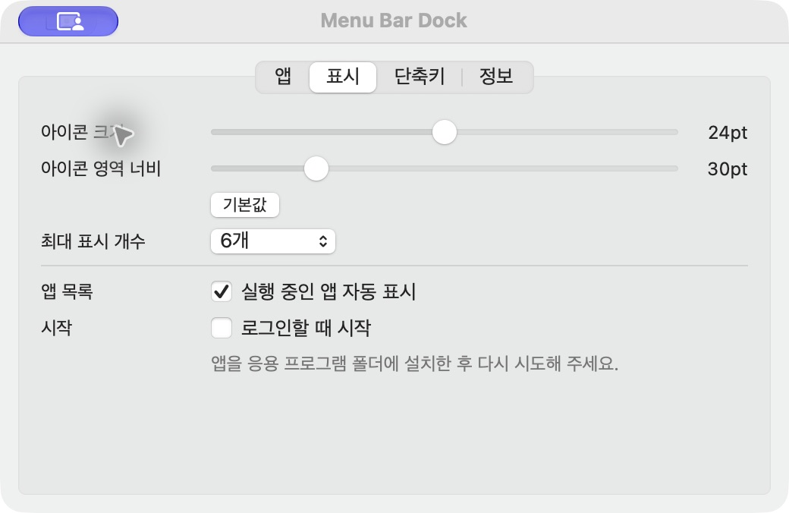

# 1.0.2 설정 접근과 크기 수정 검증

2026-09-28 · macOS 27.0 · Apple Silicon · Swift 6.4 / Command Line Tools.

## 수정한 문제

1.0.1에서는 오른쪽 마우스 이벤트를 받지 않아 설정 메뉴가 열리지 않았다. 모든 앱의 독립 상태 버튼에서 왼쪽 클릭은 앱 실행, 우클릭과 Control-클릭은 설정 메뉴로 연결했다. 메뉴의 **크기 및 간격…**은 표시 탭을 직접 연다.

40pt 이미지를 30pt 버튼에 넣던 기본값은 24pt로 보정했다. 실제 렌더 크기는 버튼 높이·너비에서 사방 2pt 여백을 남기도록 제한한다. 검증 장비의 30×22pt 버튼에서는 18×18pt로 렌더됐다. 표시 설정은 요청 크기 16~32pt, 영역 너비 22~60pt를 제공하며 기본값 버튼은 두 값만 복원한다.

실행 앱은 초기 스냅샷과 실행·종료 이벤트로 감지한다. 같은 설치 앱의 여러 PID와 고정 목록은 하나로 표시한다. 과거 파일에 이미 저장된 동일 경로·identifier 중복도 첫 사용자 ID와 순서에 합친다. 고정·제외와 최신 bookmark는 보존하고 다른 설치본은 구분한다. 기본 메뉴 막대 표시 한도 6개와 자동 감지는 별개이며, 초과 앱은 선택 패널에서 접근한다.

## 실행한 검사

| 검사 | 결과 |
| --- | --- |
| Swift 6 strict build | `swift build -Xswiftc -warnings-as-errors` 통과. CLT의 기존 linker 경로 경고는 별개 |
| 전체 테스트 | 앱/UI 35, 단축키 15, 플랫폼 17, 저장소 22, 도메인 16 — 총 105개 통과 |
| 독립 상태 버튼 입력 | 실제 NSApplication → NSWindow → NSStatusBarButton 왼클릭 8개 AppID 전달 통과 |
| 우클릭 메뉴 | 실제 제품 NSMenu.popUp 경로 8회 tracking 시작·종료 및 설정 action 선택 통과. 앱 실행 없음 |
| Control-클릭·접근성 | 실제 메뉴에서 표시 설정 선택, 이후 접근성 press로 앱 실행 통과 |
| 저장 형식 | v1 기본18→24, v2 기본40→24, 사용자 값·순서 보존, 미래 형식 보호 통과 |
| 자동 감지·중복 | 초기 고정 앱/다중 PID, 새 앱 추가, 종료·재실행, 제외 유지, 저장 중복 병합 통과 |
| 실제 설정 창 | 크기20/너비36으로 변경 후 기본값24/30 복원 확인. 자동 표시 켜짐과 최대6개 유지 |
| 실제 사용자 설정 | 교체 전후 7개 앱의 상대 순서·고정·제외 동일함을 JSON 비교로 확인 |
| 배포 번들 | Release arm64, 서명 검사, self-test 4개, 실제 시작·저장·정상 종료 통과 |
| 배포 파일 | 1.0.2 ZIP/DMG 생성, SHA-256 체크 및 DMG 무결성 검사 통과 |

실제 입력 검사는 `mise run input-check`로 재현한다. 외부 앱 실행은 기록기로 대체하지만 메뉴 presenter는 대체하지 않는다. 메뉴의 실제 tracking을 확인하고 메뉴 action을 선택한다. 운영체제가 물리적 포인터 입력을 특정 디스플레이의 상태 항목에 전달하는 전체 과정은 별도 실기기 확인 범위다.

## 이미지와 한계

`appearance.png`는 실행 앱 설정 창 캡처다. `menu-bar.png`는 실제 네이티브 버튼을 개별 렌더한 뒤 나란히 배치한 480×44 이미지이며, 데스크톱 메뉴 막대 전체 캡처가 아니다.

새 버전은 기존 앱 목록을 보존해 실행했다. 물리적 두 화면의 비활성 외관, 장시간 사용, 로그인 재부팅, 다른 macOS 버전은 이번 자동 검증만으로 완료됐다고 판단하지 않는다. 이전에 보고된 “사용할 수 없음” 창은 정확한 오류 문구와 재현 조건을 확보하지 못했다. 로컬 패키지는 ad-hoc 서명이다.

원격 CI나 PR을 만들지 않았으며 `main`에 직접 커밋·푸시했다.
