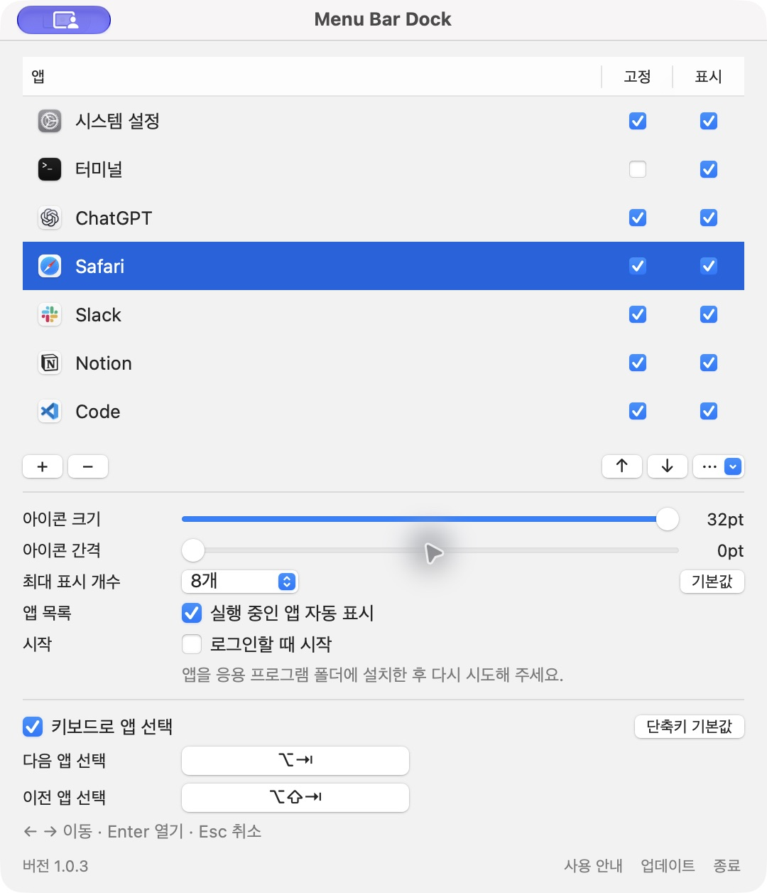

# 1.0.3 목록·설정·크기 수정 검증

2026-09-28 · macOS 27.0 · Apple Silicon · Swift 6.4 / Command Line Tools.

## 재현한 원인과 변경

- **크기를 올려도 아이콘이 같음:** 이전 이미지로 정해진 버튼 높이를 새 이미지 크기의 상한으로 사용했다. 수정 전 18/24/30pt 요청이 모두 18pt, 같은 픽셀 면적으로 렌더됐다. 이 순환 제한을 제거하고 요청 크기와 필요한 버튼 크기를 함께 반영한다.
- **슬라이더 손잡이 떨림:** 드래그 도중 관찰 알림이 반올림된 저장값을 손잡이에 다시 썼다. 실제 긴 드래그에서 13회 값 덮어쓰기를 재현했다. AppKit의 tracking 동안 값 재설정을 막고 손을 놓을 때 최종 값을 확정한다.
- **Dock 고정 앱 누락:** 실행 앱 관찰만으로는 종료된 고정 앱을 알 수 없었다. Dock의 고정 앱과 Finder를 자동으로 읽으며 파일 변경 감시로 새 고정 앱도 추가한다. Finder의 `FNDR` 번들은 정확한 시스템 경로와 identifier에 한해 허용한다.
- **삭제해도 행이 남음:** 실행 중 앱의 삭제를 제외 체크로 치환했다. 이제 행을 제거하고 별도 삭제 기록으로 자동 재추가를 막는다. 명시적 `+`만 복원한다.
- **설정 구조·간격:** 탭·카드·수동 Dock 가져오기 버튼을 없앴다. 아이콘 크기와 추가 간격을 따로 조절하며 기본값은 24pt와 0pt다. 크기 변경은 간격을 유지한다.

## 검사 결과

| 검사 | 확인 결과 |
| --- | --- |
| Swift 6 strict build | `swift build -Xswiftc -warnings-as-errors` 통과 |
| 자동 테스트 | 앱/UI 45, 단축키 15, 플랫폼 31, 저장소 29, 도메인 22 — 총 142개 통과 |
| 독립 상태 버튼 | 실제 NSApplication → NSWindow → NSStatusBarButton 왼클릭 8개 앱 전달 |
| 우클릭·Control-클릭 | 실제 NSMenu tracking과 설정 선택, 앱 실행 없음 |
| 접근성·크기 | AX press, 16/20/24/28/32pt 픽셀 증가, 크기 변경 뒤 왼클릭 통과 |
| 슬라이더 | 크기·간격 각각 native drag 17회, 트랙 밖 양끝 이동·모델 알림 중 손잡이와 프레임 안정, mouseup 저장 통과 |
| 삭제 | 실제 실행 중 앱의 controller 삭제, 표의 연속 삭제·선택·빈 목록 버튼 상태, 재감지·재시작·명시적 복원 통과 |
| Dock 감시 | 원자 교체와 직접 쓰기, 파일 삭제·재생성, 일시 읽기 실패, 제한된 재시도, 무관한 변경 무시, stop/restart 통과 |
| Dock 병합 | 종료된 고정 앱·Finder, 중복 제거, 기존 순서·제외·고정 해제·삭제 유지, 이전 해석 실패 재시도 통과 |
| 실제 설정 창 | Ollaya를 `−`로 제거해 행이 사라짐을 확인. 종료·재실행 뒤에도 삭제한 행은 복원되지 않음 |
| 실제 저장 상태 | Finder 포함 Dock 경로 7개 확인. 아이콘 32pt·추가 간격 0pt·최대 8개가 재실행 후 유지되고 설치 경로 중복 없음 |
| 앱 번들 | Release arm64, 서명 검사, self-test 4개, 초기 상태의 Dock 앱 7개 감지·저장·정상 종료 통과 |
| 배포 파일 | 1.0.3 ZIP·DMG 생성, SHA-256 및 DMG 무결성 통과 |

전체 테스트 후 추가된 저장소·도메인 경계 사례는 해당 suite를 다시 실행해 확인했다. CLT에 존재하지 않는 Developer 검색 경로에 대한 linker warning은 기존 환경 문제이며 Swift 소스의 경고와 구분한다.

실제 렌더링은 40pt 고정 슬롯에서 다음과 같이 달라졌다. 픽셀 면적은 동일한 앱 이미지의 불투명 부분을 측정했다.

| 요청 크기 | 실제 imageRect | 픽셀 면적 |
| --- | --- | ---: |
| 16pt | 16×16pt | 736 |
| 20pt | 20×20pt | 1,068 |
| 24pt | 24×24pt | 1,506 |
| 28pt | 28×28pt | 1,972 |
| 32pt | 32×32pt | 2,542 |

추가 간격 0에서는 기본 아이콘·버튼·슬롯이 모두 24pt다. 검증 장비에서 macOS 상태 창 자체는 버튼보다 총 16pt 넓었다. 이 시스템 여백과 앱의 추가 간격은 다르며, 설정 0이 모든 macOS 여백까지 없앤다는 의미는 아니다.

재현 명령은 `mise run check`, `mise run input-check`, `mise run settings-input-check`, `mise run app`, `mise run smoke`, `mise run package`다. 앱 번들을 다시 만들 때는 실행 중인 동일 번들을 먼저 정상 종료한다.

## 화면과 검증 범위

`settings-1.0.3.png`는 해당 버전 Release 앱 캡처다. `menu-bar.png`는 실제 시스템 버튼을 각각 렌더한 뒤 나란히 배치한 참고 이미지이며, 데스크톱 메뉴 막대 전체 캡처가 아니다. 선택 패널은 같은 표시 대상 모델을 사용하며 메뉴 막대 개수 제한과 별개다.

Dock 변경 감시는 임시 plist 파일에서 검사했고 사용자의 macOS Dock 설정은 변경하지 않았다. 물리적 다중 디스플레이의 비활성 외관, 재부팅 후 로그인 시작, 다른 macOS 버전, 장시간 에너지 측정은 이번 검증으로 완료됐다고 주장하지 않는다. 로컬 패키지는 ad-hoc 서명이며 Developer ID 서명·공증을 대신하지 않는다.

PR과 GitHub CI 없이 `main`에 직접 커밋·푸시한다.
